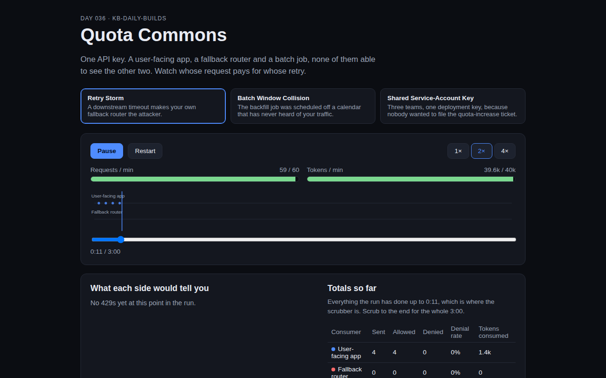

<div align="center">

# Quota Commons

**Whose request pays for whose retry when three consumers share one key?**

[](https://github.com/kbipul/quota-commons/actions/workflows/ci.yml)
[](https://kbipul.github.io/quota-commons/)

`Day 036` of **[kb-daily-builds](https://github.com/kbipul/kb-daily-builds)** — one AI project a day.

</div>

## What it does

A rate limit is provisioned per API key, not per team, per job or per code path. Quota Commons simulates one
shared key's RPM/TPM budget being drawn down by three consumers at once: a steady user-facing app, a fallback
router that retries hard when something times out, and a batch job on its own schedule. It shows what each
consumer's own dashboard would say next to what actually happened on the wire. It's a deterministic client-side
simulation, no real API is called, and every number is illustrative.


<sub>Captured automatically by CI after publish; this sandbox can't run a browser to take it directly.</sub>

## Try it

[Live demo →](https://kbipul.github.io/quota-commons/) — runs fully in your browser, nothing to install.

```bash
npm install
npm test        # 21 Vitest cases
npm run dev     # local dev server
```

## How it works

Two continuous [token buckets](src/lib/bucket.ts), one for requests/minute and one for tokens/minute, refill at
`capacity / 60` per second and cap at `capacity`. Every simulated second, each consumer's traffic-shape (a list
of `{start, end, requestsPerSecond, tokensPerRequest}` phases) contributes a fractional request count that
accumulates until it crosses 1, at which point it fires. This is deterministic, no randomness, so a given
scenario always produces the same trace (`simulate.test.ts` checks this by running a config twice and diffing
the JSON).

A fired request must clear both buckets to succeed. When it's denied, [`attributeDenials`](src/lib/simulate.ts)
looks back a configurable window (5s by default) and finds whichever consumer consumed the largest token share
in that window: that's the "actually happened" line the UI shows next to the victim's plain 429.

```
consumer.phases[] ──▶ accumulate fractional requests/tick ──▶ fire ──▶ TokenBucket(rpm) ──▶ TokenBucket(tpm) ──▶ allow/deny
                                                                                                       │
                                                                                         attributeDenials(window) ──▶ culprit
```

The three preset scenarios (`src/lib/presets.ts`) are declared as plain data, not hardcoded flows, so a fourth
scenario is a new object in that array, not new UI code.

## Build notes — what I learned

The first full test run failed on three assertions, and all three were the same mistake in different clothes.
I'd written the scenarios to *sound* like they'd produce cross-consumer blame without checking that the
arithmetic actually would. `shared-service-key should demonstrate at least one denial: expected 0 to be greater
than 0`, because the three consumers' combined average demand was comfortably under the refill rate, so the
bucket just sat full the entire run. `retry-storm: most denials are attributed to the fallback router: expected
4 to be greater than 4`, an exact tie, not a near-miss. And `batch-collision should show at least one
cross-consumer denial: expected false to be true`; every single 429 in that scenario blamed the batch job for
its own requests, never the smaller app sharing its key.

That last one is the real finding, and I didn't expect it going in. Once a greedy consumer's average demand
exceeds the refill rate, the bucket settles near zero and stays there, but the greedy consumer's own per-request
cost is usually too large for whatever trickles in between *its own* attempts, so it fails against its own
history, not against a neighbor. The smaller consumer's request is small enough to fit in that trickle almost
every time. Cross-consumer blame, "someone else spent your quota," only shows up when two consumers' requests
land in the *same simulated second*, so I had to deliberately phase-align two consumers' request rates
(`batch-job` and `user-app` both fire at `rps: 0.5`, guaranteeing the same ticks) and put the greedy one first in
declaration order so it claims the shared instant before the small one gets a turn. That's a real mechanism,
whichever client's socket write lands first that tick wins, but it means the demo's most dramatic moments (a
clean "victim ≠ culprit" 429) are the minority case even in a scenario built to produce them, and I'm not fully
sure that's an accurate ratio versus an artifact of how coarse a one-second tick is. Left open rather than
tuned away.

Cut for time: there's no free-form consumer editor. The three scenarios are the only ones a visitor can run;
adding a fourth means editing `presets.ts` and redeploying, not a form in the UI. A config builder was scoped
out to keep today's build to one clean mechanic plus honest presets rather than a half-finished editor.

Riding the signal: OpenAI reportedly cut ChatGPT usage limits by up to 4× for GPT-6 Astra. Reporting surfaced
6–7 Sep 2026, after a full banked reset to all subscribers on 5 Sep, and OpenAI itself hasn't confirmed the
specifics. Around the same time, Google's Antigravity users hit blanket "Individual quota reached" errors that
persisted through 13 Sep. Neither story is about several internal systems quietly sharing one key; both are
about a provider tightening the ceiling. What connects them to this build is simpler: whatever slack used to
hide an uncoordinated batch job or a retry storm inside your own quota just got smaller, on more than one
provider, in the same week.

Gates: 21 Vitest cases pass (bucket refill/cap/denial math, deterministic replay, rpm-vs-tpm denial attribution,
all three presets simulate without throwing and each produces at least one cross-consumer denial), `tsc -b`
clean under strict + noUnusedLocals, Vite build clean, `vite base="/quota-commons/"` set, smoke test green
(title served, both dist assets 200 at `/quota-commons/`), secret scan clean, no unfilled placeholders.

Corrected in the 2026-W38 audit. The totals table beside the attribution feed was
full-run while the feed was scoped to the scrubber, so the first screenshot of this
project showed 81 denials next to the sentence "No 429s yet at this point in the run."
Both panels now read the same clock, `statsUpTo()` is exported and tested, and one of
those tests asserts the two panels can never disagree again.

## Stack

| | |
|---|---|
| Framework | React 18 + TypeScript 5 |
| Build | Vite 5 |
| Tests | Vitest 2 |
| Demo | Static, client-side only. No backend, no API keys, no network calls. |

---

<div align="center"><sub>
Built by <a href="https://www.kumarbipul.com"><b>Kumar Bipul</b></a> ·
IT Director → AI/ML · <a href="https://github.com/kbipul">github.com/kbipul</a>
</sub></div>
